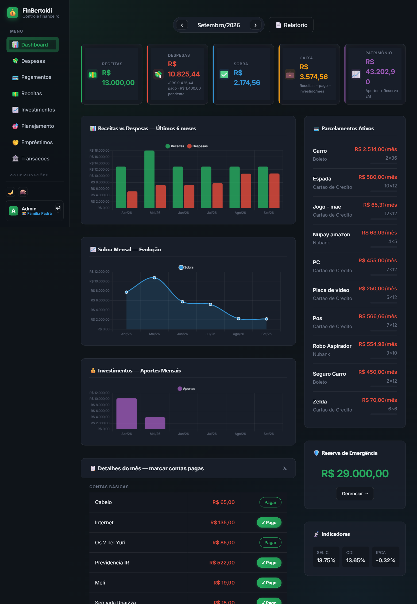

# FinBertoldi

**Sistema completo de controle financeiro familiar** — multi-tenant, com dashboard interativo, planejamento FIRE, integracao bancaria automatica e indicadores economicos em tempo real.


---

## Destaques

- **Multi-tenant** — cada familia tem dados isolados; controle de acesso granular por tela
- **Zero JavaScript frameworks** — SSR com Go templates + HTMX para interatividade
- **Dashboard rico** — cards de resumo, 3 graficos (Chart.js), toggle pago/pendente em tempo real
- **Planejamento FIRE** — taxa de poupanca, reserva de emergencia, projecao de independencia financeira
- **Integracao bancaria** — importacao CSV/OFX + sync automatico via Pluggy API
- **Indicadores economicos** — Selic, CDI, IPCA, USD, EUR, BTC (atualizados automaticamente)
- **Relatorios PDF** — 5 relatorios otimizados para impressao
- **Tema dark/light** com glassmorphism + opcao de ocultar valores

---

## Screenshots


*Dashboard com cards de resumo, grafico de evolucao e parcelamentos ativos (valores ocultos por privacidade)*

---

## Arquitetura

```
Browser (HTMX) ──── :443 ────► Caddy (HTTPS)
                                    │
                                    ▼ :8080
                            ┌───────────────┐
                            │   App (Go)    │
                            │   main.go     │
                            └──┬─────────┬──┘
                               │         │ proxy HTTP
                        ┌──────┴──┐  ┌───┴──────────────┐
                        │Postgres │  │ Pluggy Service   │
                        │  :5432  │  │   :8081 (Go)     │
                        └─────────┘  └────────┬─────────┘
                                              │ HTTPS
                                       ┌──────┴────────┐
                                       │  Pluggy API   │
                                       │ api.pluggy.ai │
                                       └───────────────┘
```

**3 containers Docker** + Caddy como reverse proxy HTTPS em producao.

---

## Stack tecnica

| Camada | Tecnologia |
|--------|-----------|
| Backend | Go 1.24 — `net/http` + `html/template` (stdlib puro, sem frameworks) |
| Frontend | HTMX 1.9.12 · Chart.js 4.4.1 · Pico CSS v2 · CSS custom (dark/glassmorphism) |
| Banco de dados | PostgreSQL 16 · lib/pq · 15 migrations automaticas |
| Autenticacao | Sessoes HTTP-only + bcrypt · recuperacao de senha via email |
| Importacao | excelize/v2 (XLSX) · ofxgo (OFX/QFX) · CSV com auto-deteccao |
| Integracoes | Pluggy API · BCB · AwesomeAPI · BrasilAPI · Telegram Bot |
| Infra | Docker Compose · Caddy (HTTPS/Let's Encrypt) · Oracle Cloud |

---

## Funcionalidades

### Financeiro
- **Dashboard** — cards de resumo (Receitas, Despesas, Sobra, Caixa, Patrimonio), graficos de evolucao, historico 6 meses
- **Despesas fixas** — recorrentes com toggle pago/pendente por mes
- **Parcelamentos** — cartao de credito com progresso visual + suporte a financiamentos com antecipacao e desconto racional
- **Receitas** — recorrentes e unicas, edicao inline
- **Investimentos** — por instituicao/tipo, totais por categoria
- **Reserva de emergencia** — depositos e retiradas com saldo
- **Emprestimos** — devo/me devem, quitacao total ou parcial
- **Planejamento FIRE** — taxa de poupanca, metas FIRE (conservador/moderado/agressivo), reserva ideal 6-12 meses

### Bancario
- **Importacao CSV/OFX** — auto-deteccao de formato, deduplicacao por FitID
- **Integracao Pluggy** — conexao automatica com bancos brasileiros, sync a cada 6h
- **Conciliacao** — vincular transacoes a despesas/receitas existentes, auto-match por valor/data

### Integracoes gratuitas (ativaveis por familia)
- **BCB** — Selic, CDI, IPCA (API Banco Central)
- **AwesomeAPI** — cotacoes USD, EUR, BTC
- **BrasilAPI** — feriados nacionais
- **Telegram Bot** — alertas de despesas pendentes
- Widget de indicadores no dashboard

### Administrativo
- **Multi-familia** — dados isolados por familia
- **Controle de acesso** — admin global, admin de familia, usuario com telas bloqueaveis
- **Import/Export XLSX** — todas as entidades em planilha multi-aba
- **Relatorios PDF** — dashboard, despesas, receitas, investimentos, emprestimos
- **Recuperacao de senha** — email com token de reset (SMTP configuravel)

### UX
- Tema dark/light com persistencia em localStorage
- Ocultar valores monetarios (privacidade)
- Ordenacao por coluna em todas as tabelas
- Selecao com barra flutuante de totalizacao
- Filtros por busca textual e selects
- Sidebar responsiva com menu mobile

---

## Controle de acesso

| Perfil | Permissoes |
|--------|-----------|
| **Admin global** | Acesso total · gerencia familias e usuarios · configura integracoes |
| **Admin de familia** | Gerencia membros · bloqueia/libera telas por usuario |
| **Usuario comum** | Acesso apenas as telas liberadas pelo admin da familia |

---

## Rodando localmente

**Pre-requisito:** Docker + Docker Compose

```bash
# Clonar e subir
git clone https://github.com/YuriBertoldi/FinBertoldi.git
cd FinBertoldi
docker compose up --build -d
```

Acesse: **http://localhost:8080**

No primeiro startup, um usuario admin e criado automaticamente com senha aleatoria exibida nos logs:

```bash
docker compose logs app | grep "admin criado"
```

> As 15 migrations do banco sao executadas automaticamente.

---

## Variaveis de ambiente

### App principal

| Variavel | Padrao | Descricao |
|----------|--------|-----------|
| `DATABASE_URL` | — | Connection string completa (prioridade) |
| `DB_HOST` | `localhost` | Host PostgreSQL |
| `DB_PORT` | `5432` | Porta |
| `DB_USER` | `fincontrol` | Usuario |
| `DB_PASS` | `fincontrol` | Senha |
| `DB_NAME` | `fincontrol` | Nome do banco |
| `PORT` | `8080` | Porta HTTP |
| `ADMIN_EMAIL` | `admin@localhost` | Email do admin inicial |
| `ADMIN_PASSWORD` | *(aleatorio)* | Senha do admin inicial |
| `SMTP_HOST` | — | Servidor SMTP (para reset de senha) |
| `SMTP_PORT` | — | Porta SMTP |
| `SMTP_USER` | — | Usuario SMTP |
| `SMTP_PASS` | — | Senha SMTP |
| `SMTP_FROM` | — | Remetente dos emails |
| `TZ` | `America/Sao_Paulo` | Timezone |

### Pluggy Service

| Variavel | Padrao | Descricao |
|----------|--------|-----------|
| `DATABASE_URL` | — | Connection string PostgreSQL |
| `PLUGGY_CLIENT_ID` | — | Client ID Pluggy (ou via UI) |
| `PLUGGY_CLIENT_SECRET` | — | Client Secret Pluggy (ou via UI) |
| `WEBHOOK_TOKEN` | — | Token de validacao de webhooks |
| `SYNC_INTERVAL` | `6h` | Intervalo de sync automatico |
| `PORT` | `8081` | Porta HTTP |

---

## Estrutura do projeto

```
finBertoldi/
├── main.go                          # Wiring: rotas + startup
├── Dockerfile                       # Multi-stage: golang:1.24 → alpine
├── docker-compose.yml               # Desenvolvimento local
├── docker-compose.prod.yml          # Producao
├── internal/
│   ├── models/models.go             # Structs de dominio e page data
│   ├── store/store.go               # Queries SQL + migrations (v1-v15)
│   ├── auth/
│   │   ├── auth.go                  # Middlewares + sessoes + bcrypt
│   │   └── email.go                 # Envio de email SMTP (reset senha)
│   ├── handler/
│   │   ├── handler.go               # Handlers HTTP principais
│   │   ├── bankimport.go            # Parsers CSV/OFX + conciliacao
│   │   ├── reports.go               # Relatorios PDF (5 telas)
│   │   └── importexport.go          # Import/Export XLSX
│   └── integrations/
│       ├── scheduler.go             # Scheduler periodico (goroutines)
│       ├── bcb.go                   # API Banco Central (Selic/CDI/IPCA)
│       ├── cotacoes.go              # AwesomeAPI (USD/EUR/BTC)
│       ├── telegram.go              # Telegram Bot (alertas)
│       ├── brasilapi.go             # BrasilAPI (feriados)
│       └── sheets.go                # Google Sheets (export)
├── templates/                       # 24 templates HTML
├── static/app.css                   # Design system completo
├── pluggy-service/                  # Microservico integracao bancaria
│   ├── main.go                      # HTTP server + sync scheduler
│   ├── pluggy/client.go             # REST client Pluggy API
│   └── sync/sync.go                 # Logica de sincronizacao
└── documentacao/                    # Documentacao detalhada (11 arquivos)
```

---

## Testes

```bash
# Unitarios (sem banco)
go test ./...

# Integracao (requer PostgreSQL rodando)
docker compose up postgres -d
go test -tags=integration ./...
```

---

## Deploy em producao

O sistema roda em Oracle Cloud com Caddy como reverse proxy HTTPS (Let's Encrypt automatico).

```bash
# Copiar .env.prod.example e configurar
cp .env.prod.example .env.prod

# Subir em producao
docker compose -f docker-compose.prod.yml --env-file .env.prod up -d --build
```

Detalhes completos em [`documentacao/10-deploy.md`](documentacao/10-deploy.md).

---

## Documentacao

Documentacao detalhada por modulo em [`documentacao/`](documentacao/):

| Arquivo | Conteudo |
|---------|----------|
| [01-visao-geral](documentacao/01-visao-geral.md) | Arquitetura, stack, multi-tenancy |
| [02-models](documentacao/02-models.md) | Structs de dominio e page data |
| [03-store](documentacao/03-store.md) | Queries SQL, migrations, funcoes por dominio |
| [04-auth](documentacao/04-auth.md) | Autenticacao, middlewares, recuperacao de senha |
| [05-handler](documentacao/05-handler.md) | Handlers HTTP, template helpers |
| [06-pluggy-service](documentacao/06-pluggy-service.md) | Microservico de integracao bancaria |
| [07-templates](documentacao/07-templates.md) | Templates HTML, layout, componentes |
| [08-rotas](documentacao/08-rotas.md) | Mapa completo de rotas |
| [09-banco-de-dados](documentacao/09-banco-de-dados.md) | Schema de todas as tabelas |
| [10-deploy](documentacao/10-deploy.md) | Deploy Oracle Cloud + Caddy |
| [11-integracoes](documentacao/11-integracoes.md) | BCB, cotacoes, Telegram, BrasilAPI |

---

## Licenca

MIT
